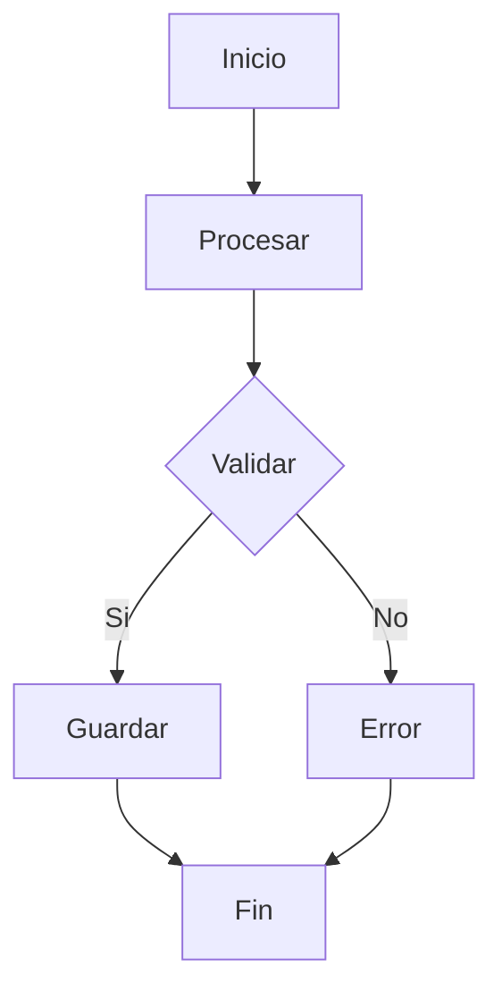

# Guías de Planificación

## Uso de update_todo_list

- Usar `update_todo_list` para tareas complejas
- Crear una lista de tareas clara y accionable
- Marcar tareas como [ ] (pending), [x] (completed), [-] (in progress)
- Actualizar la lista después de completar cada tarea

### Ejemplo
```markdown
[ ] Crear modelo User
[ ] Crear controller UsersController
[ ] Crear página Users/Index
[ ] Crear tests
```

## Diagramas Mermaid

- Incluir diagramas Mermaid para workflows complejos
- Usar diagramas para visualizar flujos de datos o procesos
- **IMPORTANTE**: Evitar usar comillas dobles ("") y paréntesis () dentro de los corchetes [] en Mermaid

### Ejemplo Correcto


### Ejemplo Incorrecto
```mermaid
graph TD
    A[Inicio con "texto"] --> B[Procesar (dato)]
    B --> C{Validar "condición"}
```

## No Estimar Tiempos

- NO estimar tiempos en horas, días o semanas
- Enfocarse en la complejidad y dependencias de las tareas
- Dejar la estimación de tiempo al usuario

## Crear Planes Claros y Accionables

- Los planes deben ser específicos y medibles
- Cada tarea debe tener un objetivo claro
- Incluir dependencias entre tareas cuando sea relevante
- Usar lenguaje técnico y preciso

## Preguntar al Usuario Antes de Implementar

- Siempre preguntar si el usuario está satisfecho con el plan
- Permitir que el usuario solicite cambios antes de implementar
- No comenzar la implementación sin aprobación

## Consideraciones de Implementación (Prompt Engineering)

Cuando analices una implementación y propongas una forma de implementarla, **SIEMPRE** debes generar **al menos 3 consideraciones** para el usuario. Estas consideraciones deben ser preguntas claras y específicas que permitan refinar la implementación.

### Patrón de Consideraciones

- Deben ser preguntas directas y accionables
- Deben cubrir aspectos importantes del proyecto (testing, traducciones, autorización, etc.)
- Deben seguir el contexto del proyecto (Rails 8 + Inertia + Vue + TS)
- Deben estar en español
- **Deben incluir consideraciones sobre:**
  - **Seguridad**: Validación de inputs, sanitización, autorización, autenticación, protección contra ataques comunes (SQL injection, XSS, CSRF)
  - **Lectura de código**: Code review considerations, claridad, mantenibilidad, documentación
  - **Convenciones del framework**: Seguir patrones de Rails/Inertia/Vue, usar generadores, estructura de archivos
  - **Optimizaciones de código**: Performance, N+1 queries, caching, lazy loading, optimización de assets
  - **Buenas prácticas de la comunidad**: Patrones recomendados, librerías populares, estándares de la industria

### Ejemplos de Consideraciones por Tipo de Implementación

#### Para crear un Model
1. ¿Deseas crear el controller y las rutas correspondientes?
2. ¿Quieres que se tengan en cuenta las traducciones de mensajes de error en `config/locales/`?
3. ¿Deseas que cree los tests unitarios en `test/models/`?
4. ¿Quieres incluir validaciones de seguridad (strong parameters, sanitización de inputs)?
5. ¿Deseas agregar índices en la base de datos para optimizar consultas?
6. ¿Quieres que se incluyan scopes y métodos de búsqueda optimizados?

#### Para crear un Controller
1. ¿Deseas crear las vistas/páginas de Inertia correspondientes en `app/frontend/Pages/`?
2. ¿Quieres que se incluyan los policies de Pundit para autorización?
3. ¿Deseas que se agreguen los `data-testid` en los elementos interactivos para testing?
4. ¿Quieres implementar sanitización de parámetros para prevenir ataques?
5. ¿Deseas agregar caching para optimizar respuestas frecuentes?
6. ¿Quieres que se incluyan callbacks para auditoría de cambios?

#### Para crear una Página Vue
1. ¿Deseas crear los componentes reutilizables en `app/frontend/Components/`?
2. ¿Quieres que se incluyan las traducciones en `config/locales/frontend.es.yml`?
3. ¿Deseas que se agreguen los tests de Playwright en `test/system/`?
4. ¿Quieres implementar lazy loading de componentes para optimizar el bundle?
5. ¿Deseas agregar validaciones de seguridad en el frontend (sanitización de inputs)?
6. ¿Quieres que se incluya manejo de errores con notificaciones al usuario?

#### Para crear un Job
1. ¿Deseas crear los eventos y event handlers correspondientes en `app/events/` y `app/event_handlers/`?
2. ¿Quieres que se incluyan las notificaciones con `noticed`?
3. ¿Deseas que se agreguen los tests en `test/jobs/`?
4. ¿Quieres implementar reintentos con backoff exponencial para manejar fallos?
5. ¿Deseas agregar logging detallado para debugging y auditoría?
6. ¿Quieres que se incluya manejo de errores con notificaciones de fallo?

#### Para crear un Service/Form
1. ¿Deseas incluir validaciones personalizadas con mensajes traducidos?
2. ¿Quieres que se maneje la autorización con Pundit?
3. ¿Deseas que se agreguen los tests unitarios correspondientes?
4. ¿Quieres implementar sanitización de datos para prevenir inyección de código?
5. ¿Deseas agregar transacciones de base de datos para garantizar consistencia?
6. ¿Quieres que se incluyan callbacks para auditoría de cambios?

### Formato de las Consideraciones

Las consideraciones deben presentarse al final de la propuesta de implementación, antes de preguntar al usuario si está satisfecho con el plan.

#### Ejemplo de Formato
```markdown
## Consideraciones

1. ¿Deseas crear el controller y las rutas correspondientes?
2. ¿Quieres que se tengan en cuenta las traducciones de mensajes de error?
3. ¿Deseas que cree los tests unitarios?

¿Estás satisfecho con este plan o deseas hacer algún cambio?
```

## Criterios para Determinar si un Plan Está Completamente Refinado

Un plan se considera completamente refinado cuando:

- Cubre todos los aspectos funcionales requeridos por el usuario
- Incluye las consideraciones de seguridad, testing, traducciones, optimizaciones y buenas prácticas
- Las consideraciones propuestas son relevantes y no redundantes
- El usuario ha respondido todas las consideraciones o indicado que está satisfecho
- No hay ambigüedades o puntos sin clarificar

### Cuándo Dejar de Agregar Consideraciones

- Cuando el usuario indica que está satisfecho con el plan
- Cuando las consideraciones adicionales serían redundantes o triviales
- Cuando el plan ya cubre todos los aspectos críticos (seguridad, testing, traducciones, optimizaciones)
- Cuando el usuario ha rechazado explícitamente ciertas consideraciones

## División de Planes en Fases (para planes extensos)

Si un plan es muy extenso (más de 10-15 tareas principales), dividirlo en fases con entregables claros.

### Criterios para Dividir en Fases

- El plan tiene más de 15 tareas principales
- Las tareas pueden agruparse por funcionalidad o dependencia
- Hay dependencias claras entre grupos de tareas
- Algunas tareas son de mayor prioridad que otras

### Estructura de Fases

- Cada fase debe tener un objetivo claro y entregable tangible
- Las fases deben ser independientes entre sí (o con dependencias mínimas)
- Cada fase debe poder continuar desde la anterior sin fricción
- Incluir un diagrama de flujo entre fases si es necesario

### Ejemplo de Estructura de Fases

```markdown
## Fase 1: Core Functionality

**Objetivo**: Implementar funcionalidad básica

**Entregable**: [X] funcionalidad funcionando

**Tareas**:
- [ ] Tarea 1
- [ ] Tarea 2
- [ ] Tarea 3

## Fase 2: Advanced Features

**Objetivo**: Agregar características avanzadas

**Entregable**: [Y] características adicionales

**Tareas**:
- [ ] Tarea 4
- [ ] Tarea 5
- [ ] Tarea 6

**Depende de**: Fase 1

## Fase 3: Optimization & Polish

**Objetivo**: Optimizar y pulir la implementación

**Entregable**: [Z] mejoras de performance y UX

**Tareas**:
- [ ] Tarea 7
- [ ] Tarea 8
- [ ] Tarea 9

**Depende de**: Fase 2
```

### Transición entre Fases

- Al finalizar una fase, preguntar al usuario si desea continuar con la siguiente
- Permitir que el usuario solicite cambios o ajustes antes de continuar
- Mantener contexto de las fases anteriores para asegurar consistencia

### Ejemplo de Pregunta de Transición

```markdown
He completado la Fase 1: Core Functionality. El entregable [X] funcionalidad funcionando está listo.

¿Deseas continuar con la Fase 2: Advanced Features, o prefieres hacer algún ajuste a la Fase 1?
```

## Best Practices de Planificación

- Mantener las tareas pequeñas y manejables
- Usar verbos de acción para describir tareas
- Incluir el resultado esperado de cada tarea
- Considerar el impacto en el sistema existente
- Identificar riesgos potenciales y mitigaciones
- Asegurar que el plan sea realista y alcanzable
