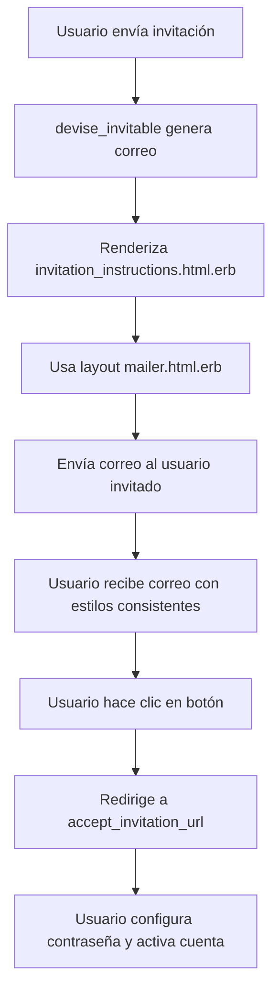

# Plan para Actualizar Correo de Invitación - devise_invitable

## Análisis de Estilos Existentes

### Estructura Común de los Correos

Todos los correos de Devise siguen este patrón:

1. **Icono** - Círculo de 72px con emoji centrado
2. **Título** - H1 centrado con Google Sans, 24px
3. **Saludo** - Párrafo centrado con nombre del usuario
4. **Mensaje principal** - Párrafo centrado con instrucciones
5. **Botón de acción** - Botón azul (#1a73e8) con texto blanco
6. **Enlace alternativo** - Sección gris (#f8f9fa) con URL completa
7. **Notas de seguridad** - Sección amarilla (#fef7e0) cuando aplica
8. **Footer** - Aviso de ignorar si no solicitó la acción

### Paleta de Colores por Tipo de Correo

| Tipo de Correo | Color Primario | Color de Fondo Icono | Emoji |
|---------------|----------------|---------------------|-------|
| Confirmation | #1a73e8 (azul) | #e8f0fe (azul claro) | ✉ |
| Reset Password | #d93025 (rojo) | #fce8e6 (rojo claro) | 🔑 |
| Password Change | #1e8e3e (verde) | #e6f4ea (verde claro) | ✓ |
| **Invitation** | **#9333ea (púrpura)** | **#f3e8ff (púrpura claro)** | **✨** |

### Tipografía

- **Títulos**: Google Sans, Roboto, Arial, sans-serif, 24px, weight 400
- **Cuerpo**: Roboto, Arial, sans-serif, 14px, line-height 20-22px
- **Pequeño**: Roboto, Arial, sans-serif, 12px, line-height 16-18px

### Colores Generales

- **Texto principal**: #202124 (gris oscuro)
- **Texto secundario**: #5f6368 (gris medio)
- **Enlaces**: #1a73e8 (azul)
- **Botón**: #1a73e8 (azul) con texto #ffffff (blanco)
- **Fondo info**: #f8f9fa (gris muy claro)
- **Fondo warning**: #fef7e0 (amarillo claro)
- **Texto warning**: #ea8600 (naranja)

## Variables Disponibles en devise_invitable

Según la documentación de devise_invitable:

- `@resource` - El usuario invitado (User model)
- `@token` - El token de invitación
- `@resource.invited_by` - El usuario que envió la invitación (si existe)
- `@resource.full_name` - Nombre completo del usuario
- `@resource.email` - Email del usuario

## Estructura del Correo de Invitación

### Secciones del HTML

```erb
<!-- Icono -->
<!-- Título -->
<!-- Saludo -->
<!-- Mensaje principal -->
<!-- Botón de acción -->
<!-- Enlace alternativo -->
<!-- Nota de seguridad -->
<!-- Footer -->
```

### Variables de URL para devise_invitable

```ruby
accept_invitation_url(@resource, invitation_token: @token)
```

## Traducciones Necesarias

### Español (devise.es.yml)

```yaml
invitation_instructions:
  subject: "Invitación para unirse a Martina"
  title: "¡Bienvenido a Martina!"
  greeting: "Hola %{name}"
  instruction: "Has sido invitado a unirte a Martina. Haz clic en el botón de abajo para aceptar la invitación y configurar tu cuenta."
  action: "Aceptar invitación"
  alternative_link: "Si el botón no funciona, copia y pega este enlace en tu navegador:"
  security_notice: "Nota de seguridad:"
  security_message: "Este enlace expirará en unos días. Si no reconoces esta invitación, ignora este mensaje."
  ignore: "Si no esperabas esta invitación, puedes ignorar este mensaje de forma segura."
```

### Inglés (devise.en.yml)

```yaml
invitation_instructions:
  subject: "Invitation to join Martina"
  title: "Welcome to Martina!"
  greeting: "Hi %{name}"
  instruction: "You've been invited to join Martina. Click the button below to accept the invitation and set up your account."
  action: "Accept invitation"
  alternative_link: "If the button doesn't work, copy and paste this link into your browser:"
  security_notice: "Security note:"
  security_message: "This link will expire in a few days. If you don't recognize this invitation, please ignore this message."
  ignore: "If you weren't expecting this invitation, you can safely ignore this message."
```

## Archivos a Crear/Modificar

1. **Crear**: `app/views/devise/mailer/invitation_instructions.html.erb`
   - Estructura HTML con estilos consistentes
   - Icono púrpura con emoji ✨
   - Botón de acción con enlace a accept_invitation_url
   - Sección de enlace alternativo
   - Nota de seguridad
   - Footer

2. **Modificar**: `config/locales/devise.es.yml`
   - Agregar sección `invitation_instructions` con todas las traducciones en español

3. **Modificar**: `config/locales/devise.en.yml`
   - Agregar sección `invitation_instructions` con todas las traducciones en inglés

## Diagrama de Flujo del Correo



## Estilos CSS Inline (para compatibilidad con email clients)

Todos los estilos están inline en el HTML para máxima compatibilidad. No se usan hojas de estilo externas ni `<style>` tags complejos.

## Consideraciones Especiales

1. **Compatibilidad**: El diseño usa tablas HTML para máxima compatibilidad con clientes de correo (Outlook, Gmail, etc.)
2. **Responsivo**: El diseño es responsivo con `max-width: 600px` para el contenedor principal
3. **Variables dinámicas**: Se usa `@resource.full_name || @resource.email` para el saludo
4. **Invitado por**: Se puede incluir información sobre quién envió la invitación usando `@resource.invited_by&.full_name` si se desea

## Pruebas Recomendadas

1. Probar el correo en diferentes clientes (Gmail, Outlook, Apple Mail)
2. Verificar que el enlace de invitación funcione correctamente
3. Probar con usuarios que tienen nombre completo y sin nombre completo
4. Verificar traducciones en español e inglés
5. Probar la expiración del token de invitación
